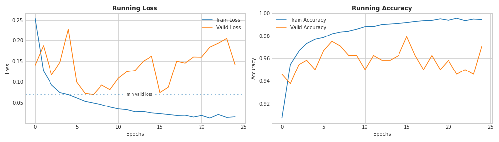
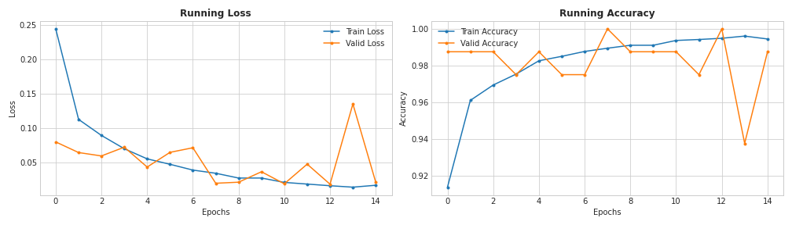
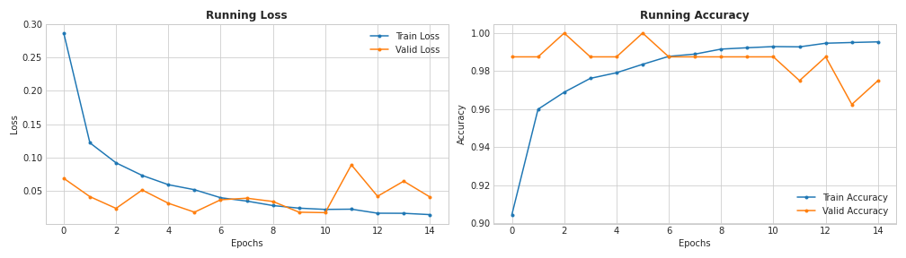
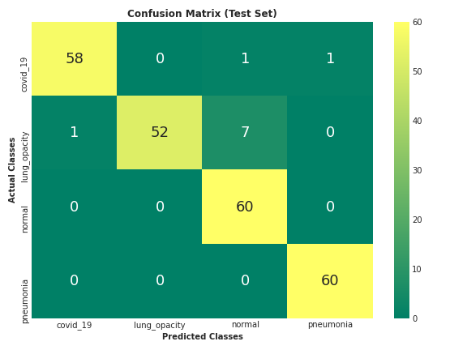
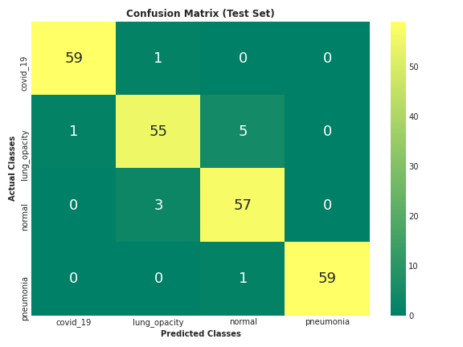
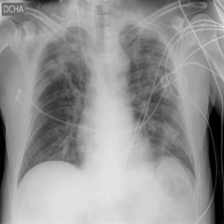
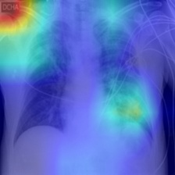
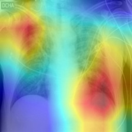
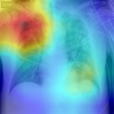

# Classification and Gradient-based Localization of Chest Radiographs

## Contents
- [Introduction](#introduction)
- [Overview](#overview)
- [Steps](#steps)
- [Results](#results)
- [Conclusions](#conclusions)
- [References](#references)

## Introduction
> A team of radiologists from New Orleans studied the usefulness of Chest Radiographs for diagnosing COVID-19 compared to the reverse-transcription polymerase chain reaction (RT-PCR) and found out they could aid rapid diagnosis, especially in areas with limited testing facilities [[1]](https://pubs.rsna.org/doi/10.1148/ryct.2020200280 "A Characteristic Chest Radiographic Pattern in the Setting of the COVID-19 Pandemic"). 
> Another study found out that the radiographs of different viral cases of pneumonia are comparative, and they overlap with other infectious and inflammatory lung diseases, making it hard for radiologists to recognize COVID‐19 from other viral pneumonia cases [[2]](https://pubs.rsna.org/doi/10.1148/rg.2018170048 "Radiographic and CT Features of Viral Pneumonia"). 
> This project aims to make the former study a reality while dealing with the intricacies in the latter, with the help of Deep Learning. 

## Overview
> The project uses the COVID-19 Radiography Database [[3]](https://www.kaggle.com/tawsifurrahman/covid19-radiography-database) as it's dataset.
> It has a total of `21165` Chest X-Rays (CXRs) belonging to 4 different classes (`COVID-19`, `Lung Opacity`, `Normal` and `Viral Pneumonia`). 
> Three top scoring CNN architectures, __VGG-16__, __ResNet-18__ and __DenseNet-121__, trained on the ImageNet Dataset [[4]](http://image-net.org/), were chosen for __fine-tuning__ on the dataset. 
> The results obtained from the different arcitectures were then evaluted. 
> Finally, with the help of __Gradient weighted Class Activation Maps__ (Grad-CAM) [[5]](https://arxiv.org/abs/1610.02391 "Grad-CAM: Visual Explanations from Deep Networks via Gradient-based Localization") the affected areas in CXRs were localized. 

* ___Note:___ The dataset and the trained models can be found in [here](https://drive.google.com/drive/folders/14L8wd-d2a3lvgqQtwV-y53Gsnn6Ud2-w?usp=sharing). 

## Steps
> 1. [Explore dataset](./1_data_exploration.ipynb "1_data_exploration.ipynb")
> 2. [Split the dataset as follows](./split_dataset.py "split_dataset.py")
>    |Type|COVID-19|Lung Opacity|Normal|Viral Pneumonia|Total|
>    |:-|-:|-:|-:|-:|-:|
>    |Train|3496|5892|10072|1225|20685|
>    |Val|60|60|60|60|240|
>    |Test|60|60|60|60|240|
> 3. [Fine-tune VGG-16, ResNet-18 and DenseNet-121](./2_finetune_models.ipynb "2_finetune_models.ipynb")
>    1. [Define Transformations](./utils.py#L15-L41)
>    2. [Handle imbalanced dataset with Weighted Random Sampling (Over-sampling)](#)
>    3. [Prepare the Pre-trained models](./networks.py "networks.py")
>    4. [Fine-tune step with Early-stopping](./utils.py#L91-L159)
>    5. [Plot running losses & accuracies](./plot_utils.py#L8-L42)
>       |Model|Summary Plot|
>       |:-:|:-:|
>       |VGG-16||
>       |ResNet-18||
>       |DenseNet-121||
> 4. [Evaluate Results](./3_evaluate_results.ipynb "3_evaluate_results.ipynb")
>    1. [Plot confusion matrices](./plot_utils.py#L45-L69)
>    2. [Compute test-set Accuracy, Precision, Recall & F1-score](./utils.py#L72-L88)
>    3. [Localize using Grad-CAM](./grad_cam.py)
>  
 

## Results

<table>
<tr>
<th></th>
<th>VGG-16</th>
<th>ResNet-18</th>
<th>DenseNet-121</th>
</tr>
<tr>
<td>

|__Pathology__|
|:-|
|COVID-19|
|Lung Opacity|
|Normal|
|Viral Pneumonia|

</td>
<td>

|Accuracy|Precision|Recall|F1-Score|
|-:|-:|-:|-:|
|0.9956|0.9833|1.0000|0.9916|
|0.9582|0.8833|0.9464|0.9138|
|0.9622|0.9667|0.8923|0.9280|
|0.9913|0.9833|0.9833|0.9833|
            
</td>
<td>

|Accuracy|Precision|Recall|F1-Score|
|-:|-:|-:|-:|
|0.9871|0.9667|0.9830|0.9748|
|0.9664|0.8667|1.0000|0.9286|
|0.9664|1.0000|0.8823|0.9375|
|0.9957|1.0000|0.9836|0.9917|
            
</td>
<td>

|Accuracy|Precision|Recall|F1-Score|
|-:|-:|-:|-:|
|0.9957|0.9833|1.0000|0.9916|
|0.9623|0.9167|0.9322|0.9244|
|0.9623|0.9500|0.9047|0.9268|
|0.9957|0.9833|1.0000|0.9916|
            
</td>
</tr>
<tr>
<td>Confusion Matrices</td>
<td>

</td>
<td>

</td>
<td>

</td>
</tr>
</table>
 

### __Localization with Gradient-based Class Activation Maps__
<table>
<tr>
<th>

</th>
<th>

</th>
<th>

</th>
<th>

</th>
</tr>

<tr>
<td>Original Image</td>
<td>GradCAM(VGG-16)</td>
<td>GradCAM(ResNet-18)</td>
<td>GradCAM(DenseNet-121)</td>
</tr>

</table>
 

## Conclusions
> - DenseNet-121 having around `7.98 Million` parameters did better than VGG-16 and ResNet-18, with `138 Million` and `11.17 Million` parameters respectively. 
> - Increasing model's parameter count doesn’t necessarily mean better results, but increasing residual connections might. 
> - Random Oversampling helped in dealing with imbalanced data to a great extent. 
> - Fine-tuning helped substantially by dealing with the comparatively small dataset and speeding up the training process. 
> - GradCAM aided in getting insights about the areas in image that decides a model's predictions. 
> - Looking back at the results, it is safe to assume that the models did a good job distinguishing various infectious and inflammatory lung diseases, which was rather hard manually. 

## References
> [1] David L. Smith, John-Paul Grenier, Catherine Batte, and Bradley Spieler. __A Characteristic Chest Radiographic Pattern in the Setting of the COVID-19 Pandemic.__ Radiology: Cardiothoracic Imaging 2020 2:5. 
> [2] Hyun Jung Koo, Soyeoun Lim, Jooae Choe, Sang-Ho Choi, Heungsup Sung, and Kyung-Hyun Do. __Radiographic and CT Features of Viral Pneumonia.__ RadioGraphics 2018 38:3, 719-739. 
> [3] Tawsifur Rahman, Muhammad Chowdhury, Amith Khandakar. __COVID-19 Radiography Database.__ Kaggle. 
> [4] Deng, J. et al., 2009. __Imagenet: A large-scale hierarchical image database. In 2009 IEEE conference on computer vision and pattern recognition.__ pp. 248–255. 
> [5] Ramprasaath R. Selvaraju, Michael Cogswell, Abhishek Das, Ramakrishna Vedantam, Devi Parikh, Dhruv Batra. __Grad-CAM: Visual Explanations from Deep Networks via Gradient-based Localization.__ arXiv:1610.02391v4.